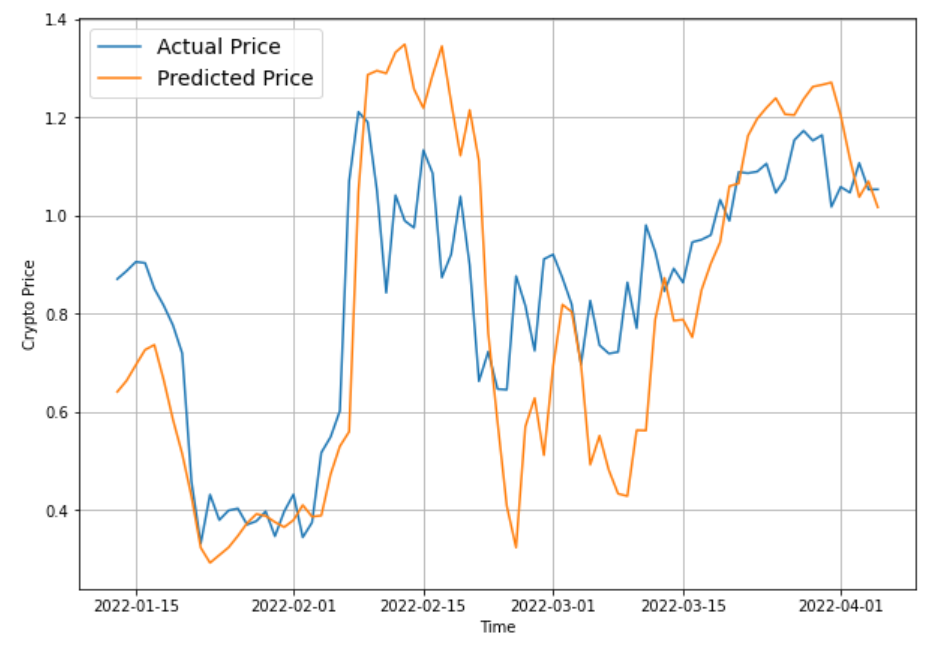

# MyProjects
If you are looking for what I have done before, please start here!

## Python
### 1) Heicoders Applied Machine Learning Capstone Project <a href="https://github.com/JeremyPanalytics/MyProjects/blob/main/Jeremy_Pan_Capstone.ipynb"> Link here <a>
- <a href="https://heicodersacademy.com/AI200-applied-machine-learning-course"> AI200 Course Link </a>
- As a Loan Default Prediction Competition, I worked on predicting defaulters based on the LendingClub Loan Default Dataset on Kaggle.
- Through the course and project, I learnt how to clean and prepare data for analysis, visualise data, and use machine learning models to predict defaulters.
- The project only shows the *final* TensorFlow model I used. 
- I tried other models such as Support Vector Machines (SVM) and Random Forests.
- 2nd Place! Won a $50 GrabFood voucher.
- Written on Jupyter.

### 2) TensorFlow: Using Long-short term memory (LSTM) to predict Ripple price <a href="https://github.com/JeremyPanalytics/MyProjects/blob/main/timeseries_analysis_lstm.ipynb"> Link here </a>
- Learning TensorFlow developer certification <a href="https://www.udemy.com/join/login-popup/?next=/course/tensorflow-developer-certificate-machine-learning-zero-to-mastery/learn/lecture/25109862#overview"> Course Link </a>
- Decided to learn how to do LSTM models first to fulfill my dreams to make a money making algorithm.
- So, I coded my own algorithm to predict XRP (Ripple) price using the previous day closing price, EMA26, EMA12, MACD, MACD SIGNAL,	MACD Difference, and RSI.
- Needless to say, it is tough to use the model reliably. See for yourself...

- Essentially, you can see the autoregressive effects, where the performance on the day before predicts the direction on the following day.  
- Written on Google Collab.
  
### 3) 100 Days of Coding Data Science Project <a href = "https://github.com/JeremyPanalytics/MyProjects/blob/main/100-days-of-code-Data-Science-Capstone.ipynb"> Link here </a>
<ul>
  <li> Applying some data science practice to the 100 Days of Coding capstone project.
  <li> Here, I predict earnings from the data source from an American Longitudinal study.
  <li> Currently incomplete. Planning to do more analysis.
  
## R Programming
- Coming soon!
