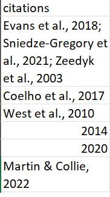

# Programming as a lazy PhD student

# Introduction

As a PhD student, I have to prepare my proposals for my advisors to vet. Recently, we shifted from the content to the formatting, which is essentially APA 7th formatting. Essentially this: 

 

 But in my work, I am typically expected to write many many many citations. I could go through the entire document and check the citations one by one. For example, I keep messing up <i>et al.</i> and <i>et al.,</i> (can you guess which one is for which?) 

 So, I realsed that with my limited knowledge on python, I could just run a code to summarise the in-text citations 

# Method

 Essentially, the code attached describes the following steps:

<ol>
  <li> I loaded in the following modules: re (for regex), pandas (for dataframes), and docx (to read word docs)
  <li> After loading in the document (in the example I gave a short version), I formatted the paragraphs into dataframes
  <li> Dataframes are used to determine where the main text starts (using introduction after the content page) 
  <li> First Regex search: finds all the parentheses e.g. (J & P, 2010), or (this is an example text)
  <li> Second Regex search A: remove all text only citations e.g. (this is an example text)
 </ol>

 However, I realised that this regex search had issues. to keep things simple, I found that the regex pattern at the end of numbers is a more viable option, so I tried this: (.*[1-2][0-9][0-9][0-9]\)$).
<ol>
  <li> It worked better!
  <li> As the previous step returned lists of lists, use list comprehension to compile one list
  <li> Remove the "()" and convert to CSV
  <li> View results in chronological order (as it appears in the document)
</ol>

Here it is: 

 Now, I do not have to scroll through the mind-numbing text just to find all the in-text citations. 

# Limitations
For now, I can only check citations in between parentheses. Example: If there were text that said J and P said this (2010), I am unable to check the formatting of J and P. But, it does not matter as much as checking formatting for (J & P, 2010). 
the other problem is one specific type in my document. example: (i.e. this explains...; J & P, 2010; for example...). This kind of citation does not show up in my results at all. 

# Further work?
Formulas to return if formatting is met. For example, if "et al." occurs within a parentheses, it should be "et al.,". 
